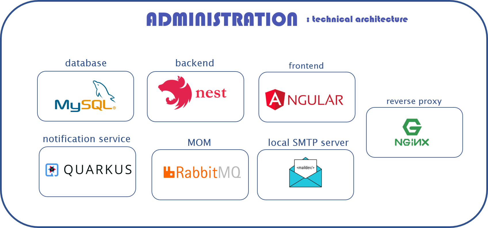

# school-projects
Presentation of some of my school projects !

## [TweetTrends](https://github.com/Kali-ki/TweetTrends)
### Presentation
📆 : 3 months (from March 2023 to May 2023) 

🧑‍💻🧑‍💻 : In pairs, with [Kilian Cornec](https://github.com/Kali-Ki) 

🛠️ : ```Python``` ```eel``` ```javascript```

📖 : In the context of our data engineering course, we carried out a project to visualize tweeter trends. The challenge was not only to visualize the data, but also to retrieve it using scrapping tools, and to clean it in order to make it meaningful.

📸 : A screenshot of the project

 

## [Kittme](https://github.com/esir-secretVideoGameDevs/gameJam2023)
📆 : 2 days - 40 hours (March 6th & 7th 2023)

🧑‍💻 🧑‍💻 🧑‍💻 🧑‍💻 🧑‍💻 : Group of 5, with [Louis-Gabriel Capliez](https://github.com/EdgeOfMemory-cloud), [Kilian Cornec](https://github.com/Kali-ki), [Valère Billaud](https://github.com/Marcsept) & [Louis Ruellou](https://github.com/Spraduss)

🛠️ : ```Unity``` ```C#```

📖 : Kittme is a game that was conceived and realized in the context of the ESIR GameJam 2023. The theme of this edition was "Break the Rules". For the rest, we had carte blanche. It was an opportunity for us to discover how to code in Unity, but more importantly to have fun, letting our imaginations run wild !

📸 : Some captures of the game. The goal is for the heroe to quit the game. However it is not that easy, given that he seems to live in an infinite loop...

 
 

## Direct Games
### Presentation
📆 : 2 months (from April 2023 to May 2023)  

🧑‍💻 🧑‍💻 : In pairs, with [Louis-Gabriel Capliez](https://github.com/EdgeOfMemory-cloud) 

🛠️ : ```Android Studio``` ```java```

📖 : As part of our mobile programming courses, we had to create a small gaming app. The idea was to learn to use the the Android API, by designing games that make the most of its main features. Therefore, we coded 6 small games :
1. _Quiz Capital_ : a multiple choice questionnaire about the world capitals.
2. _Balance It_ : a square is moving randomly and the player must place the star he is controlling on it by leaning the phone in the right direction.
3. _Mind the Swipe_ : A memory game where the player must remember the association of colors with swipe movements.
4. _Maths Questions_ : automatically generated calculus are displayed, and the player must solve them.
5. _True / False_ : a general knowledge question is asked, and the player must answer by swipping on the right or left.
6. _Light On_ : The player controls a switch by hiding or showing the luminosity sensor. He has to switch the light on during the night, and switch it off during the day.

📸 : Some captures about Light On, Balance It & True False

 
 
<br>

## [Visual Gliome](https://github.com/FenrirWolf4566/brain-tumor)
### Presentation
📆 : 5 months (from November 2022 to April 2023) 

🧑‍💻 🧑‍💻 🧑‍💻 🧑‍💻 : Group of 4, with [Louis Morlot-Pinta](https://github.com/comlouis-creator), [Benjamin De Zordo](https://github.com/FenrirWolf4566) & [Quentin Legrand](https://github.com/Nesiam)

🛠️ : ```Python``` ```FastAPI``` ```Astro``` ```Javascript```

📖 : A web App using AI for the detection of brain tumors. 

📸 : The following image is a capture of the analyzer page where the user had dropped MRI files and received an analyze from the AI.


## [While Compiler](https://github.com/Kali-ki/While-Compilateur)
### Presentation
📆 : 3 months (from mid-October 2022 to mid-January 2023) 

🧑‍💻 🧑‍💻 🧑‍💻 : Group of three, with [Bastien Faisant](https://github.com/Unstery) & [Kilian Cornec](https://github.com/Kali-ki)<br>

🛠️ : ```java``` ```antlr``` ```c++``` ```bash```

📖 : In order to illustrate our Language Theory and Compilation course, we had to build a compiler able to follow all the steps of a compilation chain, allowing to go from a source code to a result displayed in command line. This compiler being for educational purposes, the programs it compiles are those written in the 'fictional' While language, of which we wrote the grammar. 

🏗️ : [ANTLRWORKS](https://www.antlr3.org/works/) allowed us to automatically generate the code of a lexer and a parser (in java) from the description of the while language grammar that we described. We then continued by writing the code allowing us to :
1. Build a table of symbols.
2. Generate the 3 address code.
3. Interpret 3 address code to write it in a target language (we chose C++)
4. Execute the code written in this target language

### Demo
▶️ : Beware, to use it you need to have a recent java version (above v16). <br>
To start, just run ```./runner.bash program.while```. You should see a hello world message !
For more help, just type ```./runner.bash -h```. It will display advices (in french), than can be translated by :
```
Format : ./runner.bash [-a] [-t] [-c] [-r] [-p] [-e] file.while
-a : Display the AST
-t : Display the symbol table 
-c : Display the intermediate code 
-r : Create the c++ file but do not run it
-p : Do not delete the c++ file
-e : Do not delete the executable
```
Just have fun by editing the program.while, taking the [*gwhile.g*](whilecompiler/gwhile.g) rules into consideration, or reading seeing the .while file examples. And if you understand french, you can  read the [*rapport_fr.pdf*](whilecompiler/rapport_fr.pdf) file. 


## [Administration](https://github.com/LFLCH/school-projects/tree/main/administration/source)
### Presentation
📆 : 1 month (between December 2022 & January 2023) <br>

🧑‍💻 🧑‍💻: In pairs, with [Bastien Faisant](https://github.com/Unstery) <br>

🛠️ : ```angular```  ```nestjs``` ```quarkus``` ```docker```

📖 : Administration is a web app, allowing to manage associations (like sport associations) by creating, deleting and modifying one of them, likewise with member accounts. 
The construction of this app takes place in the framework of two classes : [```Web programming```](https://stephaniechallita.github.io/web/) (where we learnt how to make a backend and a frontend), and ```Software Architecture``` (where we learnt the basics of this domain, with the 'Service Oriented Computing' concept).
Having this task as a coherent project was a great opportunity to put these newly acquired skills into practice.<br>

🏗️ :Because  a picture speaks a thousand words, here is the list of the technos we used and their roles. <br>

 <br>

### Demo
▶️ : If [Docker](https://www.docker.com/) in installed on your computer, you can try it by running the following command
```bash
docker-compose -f docker-compose.administration.yml up -d
```
After, just go on your favorite browser, and visit the frontend on [```localhost```](http://localhost) (with the ```1``` & ```valid_password``` credentials), the backend's API on [```localhost/api```](http://localhost/api), and  watch the send of fake emails when creating new associations with members on [```http://localhost/maildev/#/```](http://localhost/maildev/#/)
 
📹 : Otherwise, just watch the following video showing the project in a nutshell.<br>

https://user-images.githubusercontent.com/62034725/213479168-936b3705-f282-48c8-96de-2998f2ef6636.mp4

## Simple Editor
### Presentation 
📆 : 1 month (During the whole month of October 2022) <br>

🧑‍💻 🧑‍💻 : In pairs, with [Bastien Faisant](https://github.com/Unstery) <br>

🛠️ : ```java``` ```awt```

📖 : Simple Editor is, as the name suggests a basic text editor. It has all the main common features that all text editors do share. Indeed, after having wrote some text, erasing, moving the cursor, selecting part of the text, copy, paste, undo and redo are actions you can apply to it. <br>
It takes place in the 'Tools & Methods of modeling' class, where we learnt (among other things like the importance of UML and the Software development life-cycle with agile methods) the 'design patterns' concept. We have put into practice this knowledge by implementing this editor, and trying to respect the [SOLID](https://en.wikipedia.org/wiki/SOLID) principles in the class design.

🏗️ : This project was done in java, because it is an object oriented language, which is particularly adapted to the constraints of this exercise. Moreover, it is a language that we are familiar with, which allowed us to concentrate on the design part. In addition, it allowed us to improve our skills in terms of GUI (with the swing library).

### Demo
▶️ : If Java is installed, you can try to run the jar file and enjoy playing with the editor !

📹 : You can also watch the following video to make you an idea of the final result.<br>

https://user-images.githubusercontent.com/62034725/213699879-90bce329-80d7-45a2-9de0-b41e1d800626.mp4

## [Fourmis](https://github.com/LFLCH/school-projects/tree/main/fourmis/Fourmis)
### Presentation
📆 : 1 month (Between April and May 2022)

🧑‍💻 : Just me !

🛠️ : ```c++```

📖 : Fourmis (french word for Ants 🐜) is a basic simulation of the behavior of ants when they look for food.  In this modelling, food resources (🟢) and anthills (🔵) can be created and randomly placed on the map. For each anthill's creation, a certain number of ants (⚪) are created. The goal of these ants is to seek food and bring it back to the anthill to keep it alive. To help in their search for food, and because ants are social insects, each individual produce a substance called "pheromone" during their activity, forming a path that other ants can follow. If a ant has found food, the production of pheromone will be more important, allowing a prioritization of the information. <br>
This simulation was done within the framework of our C++ class, where we learnt the specificity of the language. Before this course, our knowledge of the object model was strongly linked to java, and it allowed us to approach this concept from a new point of view, especially concerning the memory management with the manipulation of pointers and references.

🏗️ : Thanks to this project, we consolidated our knowledge in the Oriented Programming  (inheritance, polymorphism, abstraction..). It was also an opportunity to discover the concept of multi-agent systems and the programming of their behavior via a rule-based system.

### Demo
▶️ : If you have access to a c++ environment, make sure "SDL2.h" exists (you can install it with ```sudo apt-get install libsdl2-dev```), as well as for "SDL2_gfxPrimitives.h"  (follow the [repo's](https://github.com/RobLoach/sdl2_gfx) instructions to install it, then replace ```/usr/local/include/SDL2/SDL2_gfxPrimitives.h```:38 ```"SDL.h"``` by ```<SDL2/SDL.h>```). Once everything seems ready, go on Fourmis/Debug. Then run ```make all``` to create the executable and ```./Fourmis``` to start. You'll see the interface appear. There, type <kbd>f</kbd> to create food ressources,<kbd>d</kbd> to delete the last one,<kbd>a</kbd> to create an anthill, <kbd>e</kbd> to add new ants to the last anthill, and <kbd>q</kbd> to end the simulation.

📹 : If you play with it, you should see something like in the following video, or in [these](fourmis/Fourmis/img/) captures

https://user-images.githubusercontent.com/62034725/213896468-51edd675-d7ee-4bb3-8d6d-012a0cb9bba7.mp4

## Hackathon
### Presentation
📆 : 2 days (May 2022)

🧑‍💻 🧑‍💻 🧑‍💻 🧑‍💻 : Group of 4 students :  [Jérémy Bindel](https://github.com/J-Bindel), [Fanny Nyatsikor](https://github.com/itsFanix), [Yazid Benjamaa](https://github.com/Xacone).

🛠️ : ```java```

📖 : 2D action-adventure game in less than 28 hours. In Java, with the Swing library. It was a subject in its own right, but we did not have a specific lesson (we followed the instructions given in the morning)

📸 : A little picture to show how it looked. 


## Math project
### Presentation
📆 : 1 month (April - May 2022)

🧑‍💻 🧑‍💻 🧑‍💻 : Group of 3 students : [Kilian Cornec](https://github.com/Kali-ki) & [Thomas Delapart](https://github.com/Thomega35).

🛠️ : ```Matlab```

📖 : Several classical maths problems, that we had to illustrate or solve by programming in Matlab. The problems where about Statistics with random picking, Matrices manipulations with Eigenvalues, Geometry with point in a triangle tests, and Gradient Descents. 

📸 : A little overview to the graphs and UI we produced.


## Hangman Game
### Presentation
📆 : 1 month (June 2021)

🧑‍💻 🧑‍💻 : In pairs, with [Jérémy Bindel](https://github.com/J-Bindel)

🛠️ : ```HTML5``` ```CSS``` ```JavaScript``` ```PHP```

📖 : Game development with basic web and database technologies of a hangman game. It was the final part of our WEB class, where we learnt the fundamentals, with a lot of practical works.

📸 : The game looked like that. The user had to guess a word (randomly picked from the database), making as few mistakes as possible in the letters' choice.


