<p align="center">
  <a href="https://gitlab.istic.univ-rennes1.fr/hfeuilla/jxc_fradministrationfront" target="blank">
    
</a>
</p>

# Administrationfront

Bienvenue sur le front end de notre projet web "administration" d'ESIR2 SI.
Comme son nom l'indique, il permet d'avoir un accès graphique à un système de gestion administratif d'associations faisant intervenir ```utilisateurs``` et ```associations```. 

## Installation

### Prérequis
Avoir une version à jour d'<a href="https://angular.io/">Angular</a><br>
Avoir un accès à une API respectant celle du <a href="https://gitlab.istic.univ-rennes1.fr/lfiloche/projwebassociation">backend</a> de ce projet, ouverte à l'adresse ```http://localhost:3000```

### Préparation

Après avoir cloné ce projet, ne pas oublier d'installer les librairies nécessaires à son bon fonctionnement avec ```npm install```

## Exécution

Comme tout projet Angular, exécuter ```ng serve``` permet lancer l'application.
L'exécution est aussi possible, via <a href="https://docs.npmjs.com/downloading-and-installing-node-js-and-npm">npm</a> avec ```npm run start```. C'est d'ailleurs avec celle-ci que nous utilisions durant le développement. 

Quelle que soit la commande tapée, rendez-vous sur votre navigateur à l'url <a href="http://localhost:4200/">```http://localhost:4200/```</a>

## Fonctionnalités


### Session
L'ensemble des fonctionnalités du projet n'est accessible qu'une fois connecté.
Il est donc nécessaire de connaitre ses identifiants afin de pouvoir bénéficier du service. Si vous n'en avez pas, inscrivez ```1``` et ```valid_password``` comme ```identifiant``` - ```mot de passe```, c'est une combinaison proposée par le backend lors de son initialisation.<br>
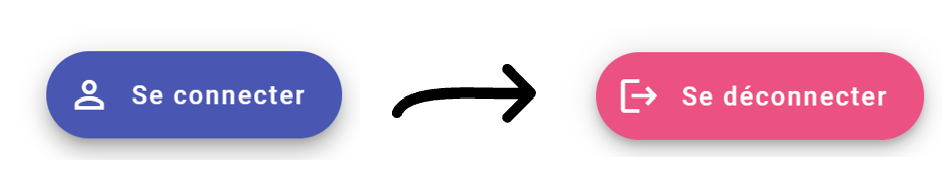


### Gestion des utilisateurs - ```/users```
- Visualiser les utilisateurs et les associations dont ils font partie<br>
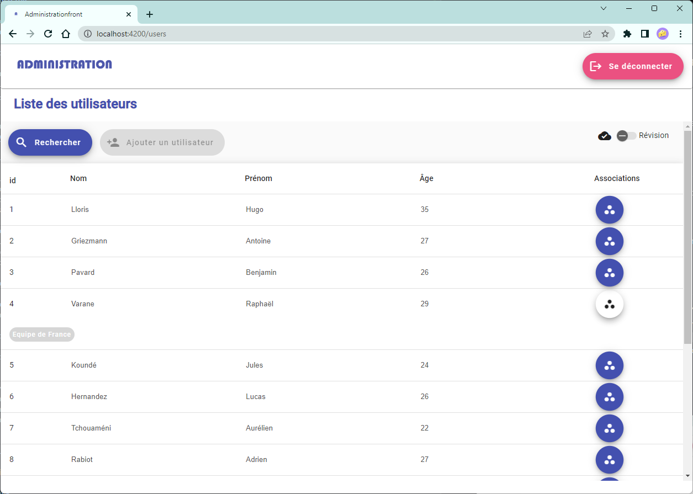

- Rechercher un utilisateur <br>
Chaque modification de champ ajoutera à l'url son nom et sa valeur. En prenant le champ id, il est alors facile de partager un lien vers un utilisateur en particulier (étant donné que l'id est unique)<br>
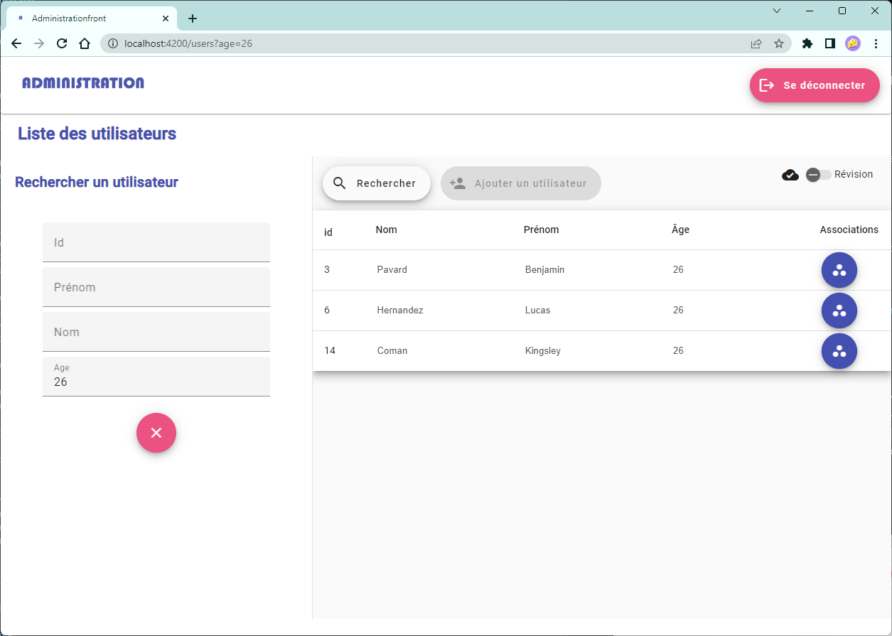

La suite des fonctionnalités est disponible lorsque l'état de la page est en mode ```Edition```. <br>
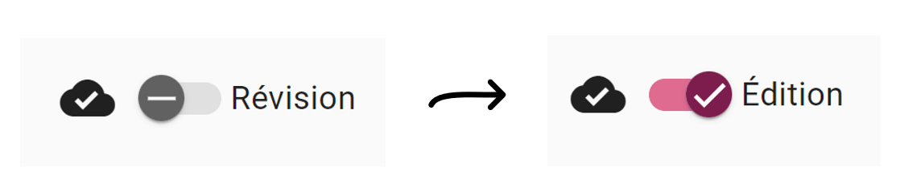

L'aperçu change légèrement, et plusieurs nouvelles options sont alors disponibles

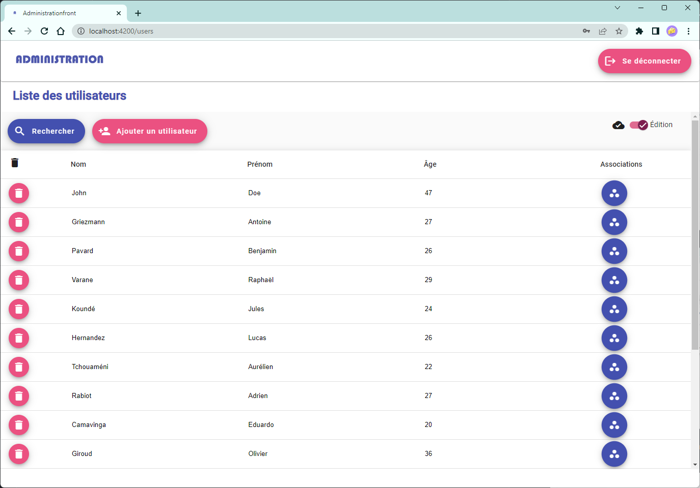

Il est alors possible de :
- Supprimer un utilisateur (en cliquant sur l'icône remplaçant le champ ```id```)
- Modifier les informations d'un utilisateur (```nom```, ```prénom```,```âge```)

Vous remarquerez d'ailleurs que lorsqu'une modification a lieu sur l'interface, l'icône de synchronisation (en forme de nuage) indique un état hors-ligne. Dès que l'utilisateur a terminé ses modifications (appuyé sur entrée ou désélectionné la cellule de saisie), les informations sont envoyées au serveur, et la réception de sa réponse est synonyme d'état synchrone.

De plus, nous avons rendu possible l'ajout d'un utilisateur, dont l'envoi des données n'est possible que si l'ensemble des champs est rempli.<br>
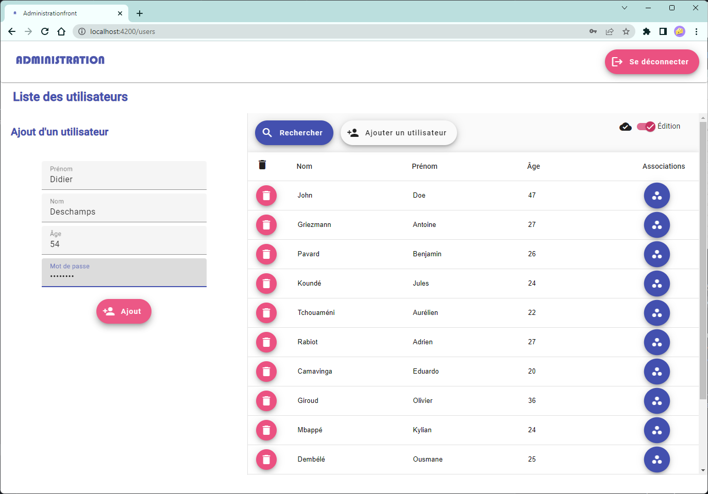

### Gestion des associations - ```/associations```

L'ensemble des fonctionnalités décrites dans la partie ```users``` est sensiblement similaire dans cette partie ```association``` concernant les associations. <br>
En effet, il est possible de :
- Visualiser les associations et leurs utilisateurs
- Rechercher une association
- (```Edition```) Modifier les informations générales d'une association 
- (```Edition```) Supprimer une association
- (```Edition```) Créer une association

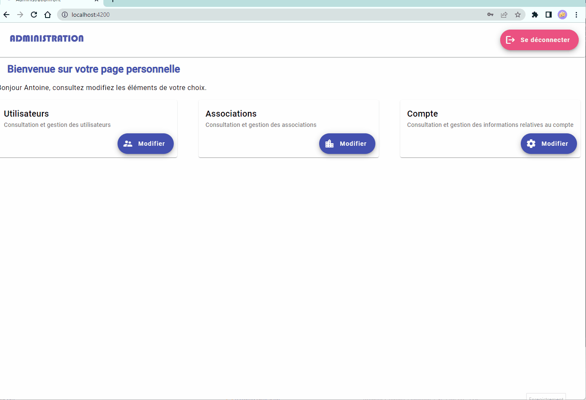

Cependant, et comme vous pouvez le voir, les associations sont un peu plus complexes que les utilisateurs.
Les associations sont **composées** d'utilisateurs, qu'on qualifie de ```membres```ou d'```adhérents```.
De ce fait, cette interface permet de :

- Modifier les adhérents d'une association. Comme lors de la création de l'association, il est possible de filtrer les utilisateurs, pour pouvoir sélectionner rapidement ceux qui feront partie de l'association.
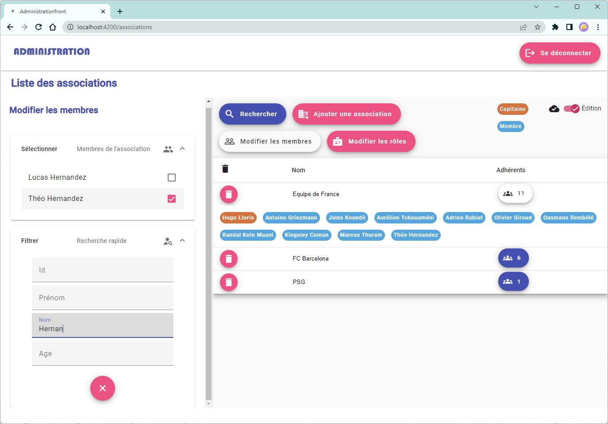


- Modifier le rôle des adhérents de l'association. Par défaut, celui donné est celui de ```membre```. Les adhérents de l'association sont organisés en fonction de leur rôle, afin de les retrouver plus facilement. L'ordre est mis à jour une fois que le panneau de modifications est fermé. <br>
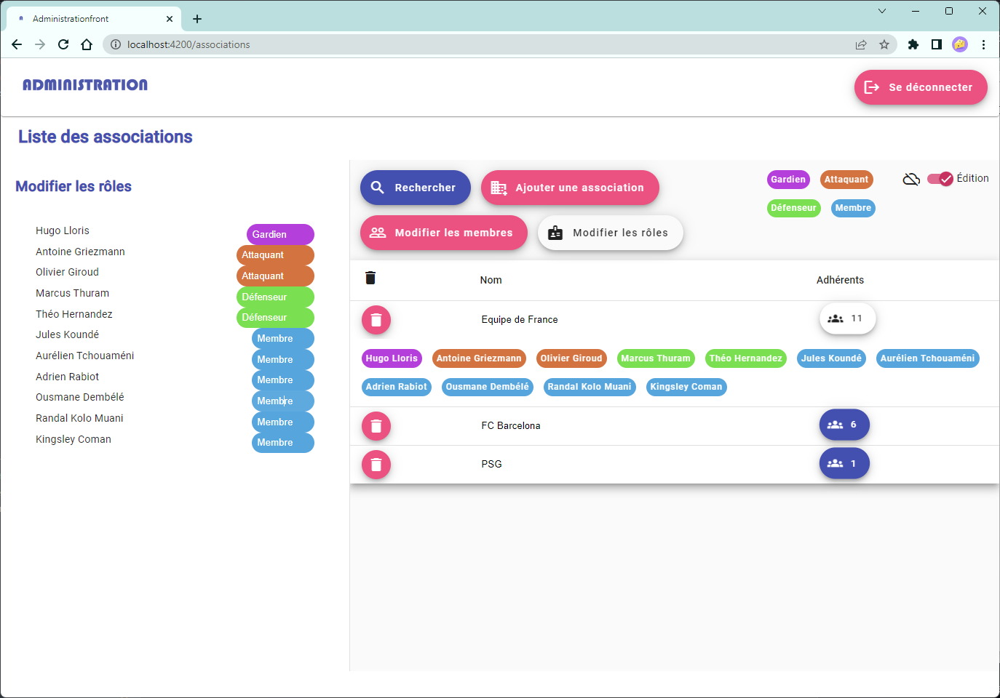

### Gestion du compte
- Gestion des informations générales
- Changement de mot de passe
- Suppression du compte

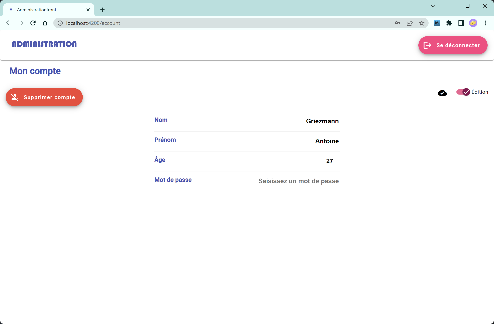


## Structure
Le projet est structuré en différents composants imbriqués :
- Avant la connexion : accès uniquement à la page d'accueil (```home```) et de connexion (```login```)
- Après être connecté : accès supplémentaire aux pages de gestion des utilisateurs, des associations et du compte

Tous les types de données représentant un utilisateur, une association ou encore les constantes ont été regroupées dans un dossier ```interfaces```.

Les services donnant accès aux informations de l'utilisateur courant figurent dans un dossier ```services```. 
Les services utilisés dédiés aux ```utilisateurs``` et ```associations``` sont eux situés dans le fichier ```.service.ts``` de leurs composants respectifs. Ils permettent d'accéder aux fonctionnalités associées de l'API (et aussi de proposer des fonctions utilisables par plusieurs composants dans le cadre des Associations, évitant ainsi la rendondance de code).

De plus, certains composants dits ```side``` contiennent un sous-composant ```core``` 🖤. La partie ```core``` est conçue dans une optique de réutilisation par d'autres composants. Quant à la partie ```side``` elle permet de mettre en forme la partie ```core``` dans le contexte voulu initialement (la partie ```drawer```  du composant Material [sidenav](https://material.angular.io/components/sidenav/) le plus généralement)

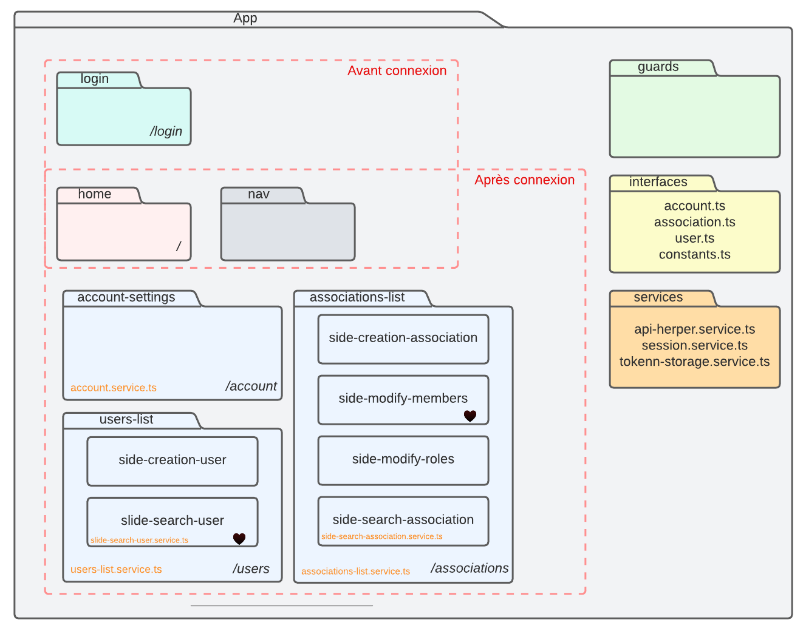


## A propos

### Angular

Ce projet a été généré avec [Angular CLI](https://github.com/angular/angular-cli) version 15.0.3.

Les composants graphiques sont tous basés sur la librairie [Material](https://material.angular.io/)

### Auteurs
Ce projet a été réalisé en binôme par @LéoFiloche et @BastienFaisant, suivant les <a href="https://gitlab.istic.univ-rennes1.fr/hfeuilla/jxc_fradministrationfront">consignes </a> des responsables de l'UE Web du S7.

