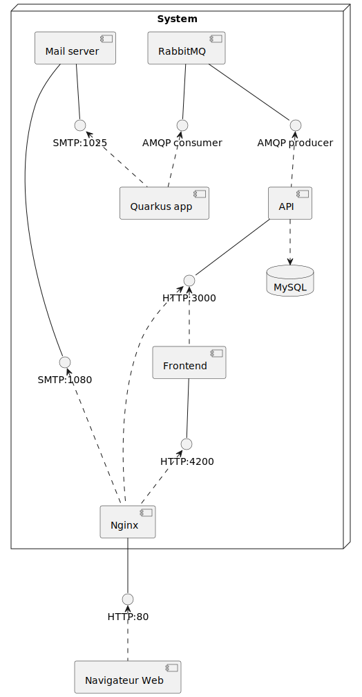
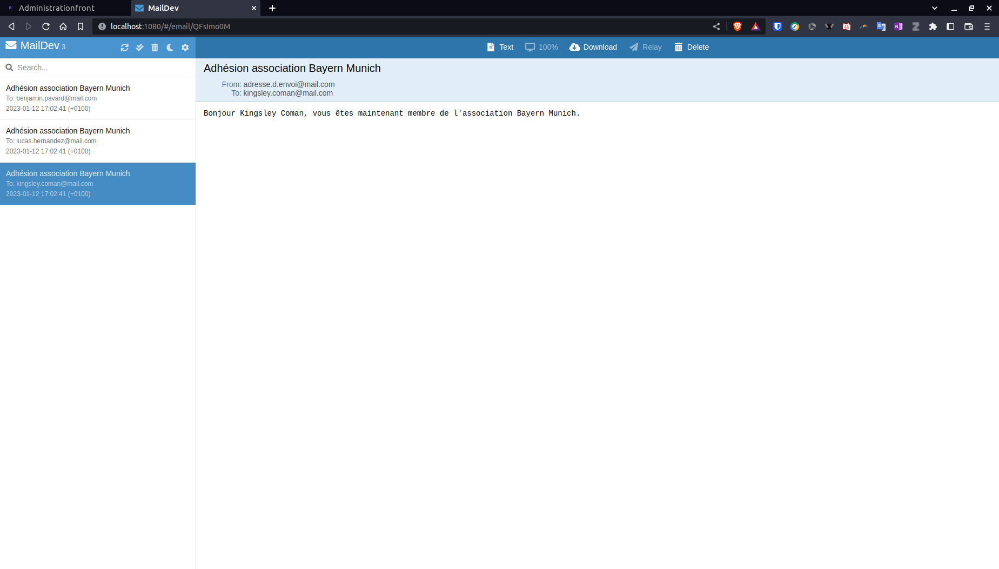

# Architecture  Logiciel : Application administration


## Exécution du projet

Le projet contient 2 docker-compose. Le premier est en mode de production et appelle donc les images de notre projet depuis le dockerhub. Quant au deuxième docker-compose, il correspond au mode de développement en faisant appel au différents Dockerfile des services de notre projet.

### Mode de développement

Certains détails n'ont pas été résolus pour pouvoir exécuter le projet en mode développement à l'aide d'une seule commande.<br>
En effet, nous devons, d'abord installer les dépendances du backend. L'origine de ce problème n'a pas été trouvée malgré que notre Dockerfile a été configuré pour installer les dépendances.
Pour cela il faut suivre ces étapes :
```Docker
# Se rendre au repertoire concerné  
cd projwebassociation/

# Installation des dépendances
npm install
```
Ensuite, les dépendances de Quarkus doivent aussi être installées à l'aide de la commande suivante :
```Docker
# Se rendre au repertoire concerné  
cd quarkus-app/

# Installation des dépendances
./mvnw package
```

Une fois ces prérequis effectués, nous pouvons exécuter le fichier 'docker-compose.dev.yml' :
```Docker
docker-compose -f docker-compose.dev.yml up -d
```

Le frontend est disponible à l'URL suivante : <a href="http://localhost:80">```http://localhost:80```</a>
Connectez vous en tant qu'utilisateur avec l'id ```1``` et le mot de passe ```valid_password```

L'interface du backend (Swagger UI) est disponible à l'URL suivante : <a href="http://localhost:3000/api">```http://localhost:3000/api```</a>

Le client SMTP MailDev est disponible à l'URL suivante : <a href="http://localhost:1080">```http://localhost:1080```</a>
Vous verrez apparaître un email à chaque fois que vous créez une association, contenant des utilisateurs.

### Mode de production
Il suffit d'exécuter directement le fichier 'docker-compose.yml' :
```Docker
docker-compose up -d
```
Le frontend est disponible à l'URL suivante : <a href="http://localhost">```http://localhost```</a>
Connectez vous en tant qu'utilisateur avec l'id ```1``` et le mot de passe ```valid_password```

L'interface du backend (Swagger UI) est disponible à l'URL suivante : <a href="http://localhost/api">```http://localhost/api```</a>

Le client SMTP MailDev est disponible à l'URL suivante : <a href="http://localhost/maildev">```http://localhost/maildev```</a>
Vous verrez apparaître un email à chaque fois que vous créez une association, contenant des utilisateurs.

## Architecture du projet

<!-- @startuml

node "System"  {
  [API] as API
database MySQL as SQL
[Frontend] as F
[Quarkus app] as Q
[RabbitMQ] as RMQ
[Nginx] as N
[Mail server] as MS

() "HTTP:4200" as 4200
() "HTTP:3000" as 3000
() "AMQP producer" as p
() "AMQP consumer" as c
() "SMTP:1025" as SMTP
() "SMTP:1080" as 1080
}

[Navigateur Web] as NW
() "HTTP:80" as 80


F -- 4200
4200 <.. N
N -- 80
80 <.. NW

API -- 3000
3000 <.. F
3000 <.. N
API ..> SQL

RMQ -- p
p <.. API

RMQ -- c
c <.. Q

MS -- 1080
1080 <.. N
MS -- SMTP
SMTP <.. Q
@enduml -->

Cette architecture a été mis en place afin de pouvoir envoyer des messages à tous les adhérents lors de la création d'une association. Pour cela le processus est de publier le message dans la queue du ```RabbitMQ``` pour qu'il soit ensuite consommé par notre microservice de notification ```Quarkus```. Par la suite, les messages sont envoyés aux mails respectifs. Pour notre part, afin d'éviter le spam de mail, ils sont envoyé au ```serveur SMTP MailDev```.



L'architecture de notre projet regroupe plusieurs services. On y retrouve :
- Le frontend Angular

Cette interface utilisateur permet la gestion des associations et des adhérents.

- L'API backend NestJS

Notre API communique avec la base de données MySQL afin d'enregistrer les données des associations et des utilisateurs. De plus, lors de la création d'une nouvelle association, elle envoie un message AMQP à la queue du RabbitMQ.

- Le microservice de notification Quarkus

Ce microservice consomme les messages de la queue du RabbitMQ par le protocole AMQP pour ensuite envoyer un mail suivant le protocole SMTP.

- Le serveur web frontend Nginx exposant notre frontend sur le port 8080

- Le MOM RabbitMQ

Ce MOM permet de faire la passerelle entre notre API NestJS et notre microservice Quarkus via le protocole AMQP.

- Le serveur SMTP MailDev

Ce serveur SMTP a pour objectif de capturer tous les mails envoyés depuis notre microservice de notification.


## Choix d'architecture

- Le choix du framework ```NestJS``` (basé sur ```Node.js```) a été fait pour son grand nombre de fonctionnalités afin de faciliter le développement web, notamment avec un système de contrôleurs et une architecture modulaire. Notre API aurait pu utiliser un framework alternatif à NestJS comme ```Express.js```. Cependant NestJS apporte une meilleure organisation de code.
- Le framework ```Angular``` (basé sur ```TypeScript```) permet la création d'application web riche en fonctionnalités et de haute performance. Il offre également une architecture modulaire, un système de composants, des directives et des services. Angular est aussi très populaire pour son utilisation de TypeScript apportant beaucoup de documentation sur son utilisation. Le frontend aurait pu être réalisé en ```Vue.js``` ou encore en ```ReactJS```.
- Notre gestionnaire de base de données relationnelle ```MySQL``` est très populaire pour sa fiabilité et sa scalabilité. Il est compatible avec de nombreux systèmes d'exploitation et langages de programmation. Une alternative serait ```PostgreSQL``` qui est plus robuste en matière de fonctionnalités avancées mais MySQL semble être plus adapté pour des projets plus "simples". L'implémentation d'un système orienté documents en NoSQL aurait pu être mis en oeuvre comme ```MongoDB```. Cependant, notre système n'avait pas l'objectif de stocker une grande quantité de données.
- Le message oriented middleware que nous avons choisi est ```RabbitMQ```. Il permet de gérer les messages asynchrones avec des fonctionnalités comme la mise en file d'attente (queue) et la persistance des messages. De plus, il est compatible avec de nombreux protocoles (dans notre projet, nous utilisons le protocole AMQP). Une alternative serait ```Apache Kafka```, qui est un système distribué pour gérer les flux de données en temps réel.
- L'utilisation de ```Quarkus``` (framework de ```Java```) permet la construction d'applications natives. Il offre des performances élevées, une faible utilisation des ressources et une rapidité de démarrage. 
- Le serveur web ```Nginx``` offre des performances élevées, une gestion efficace des connexions et une sécurité renforcée.


## Fonctionnalités

Voici la liste des services que nous avons implémentés :
- API NestJS backend
- MySQL
- Angular frontend
- Nginx
- Microservice Quarkus
- RabbitMQ
- Serveur MailDev


### Envoi de mail

Lors de la création d'une association, un mail est envoyé à ses nouveaux adhérents. En effet, après que l'association soit créée, une liste de ```Message``` est constituée suivant le nombre d'adhérents. Ces ```Message``` inclut le mail de l'adhérent, l'objet du mail ainsi que le texte à envoyer. Ensuite les messages sont émis dans la queue ```messages``` du RabbitMQ. Tant que ces messages n'ont pas été reconnu par un consommateur, ils persistent dans la file d'attente. Donc, quand notre microservice s'active, il récupère les messages afin de les interpréter puis de les envoyer au serveur SMTP MailDev se trouvant sur le port ```1025```.



## Minimisation des ports exposés en production

Notre projet a un unique port qui est exposé à l'extérieur, il s'agit du port 80 utilisé avec Nginx comme reverse proxy.
Donc la seule manière d'accéder à nos services dans le docker-compose est de passer par Nginx qui sécurise notre projet.


## Commentaires

### Difficultés rencontrées

Ce projet nous a énormément apporté en termes de communication entre les divers microservices. En effet, nous avons pu découvrir l'utilité de dockeriser un service et de l'ajouter dans docker-compose afin d'exécuter ces conteneurs dans un même réseaux. Nous avons aussi compris l'intérêt d'un RabbitMQ pour faire persister les messages.
Cependant, bien que nous ayions appris énormément, cela s'est fait dans la difficulté. Chaque partie du projet concernait une technologie/un framework que nous ne connaissions pas jusqu'alors (docker, RabbitMQ, quarkus..). Pour chacune d'entre elle, il a fallu se former, ce qui a pris du temps, puis, parfois à tâtons, comprendre comment réaliser ce qui était demandé, et s'assurer que cela correspondait bien aux consignes. Au départ, nous avons eu du mal à comprendre l'objectif du projet que ce soit en matière de finalité mais aussi le processus qu'il fallait mettre en place pour finaliser ce projet. 
Pour résumer, ce projet nous a permis de de nous former aux principaux composants d'une architecture logicielle. Cela fut une activité extrèmement enrichissante, qui a représenté beaucoup d'heures de formation et de développement en autonomie. Avoir plus d'heures et de séances de TP tout au long du semestre n'aurait pas été de refus, car nous aurions pu discuter de vive voix sur nos points de blocage.  


### Fonctionnalités non implémentées

Certaines fonctionnalités n'ont pas pu être mis en oeuvre dans notre projet :
- Insertion d'une pièce jointe de format ical dans le mail
- Le test de charge de notre application (Load testing)
- Surveillance des applications (Application monitoring)

## Auteurs

Ce projet a été réalisé en binôme par @LéoFiloche et @BastienFaisant.<br>
Dernière contribution faite le 12 janvier 2023.
