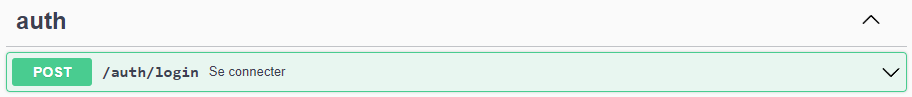

<p align="center">
  <a href="https://github.com/stephaniechallita/WebServer-course" target="blank">
    
</a>
</p>

# Projwebassociation (Administration backend)

Bienvenue sur le back end de notre projet web "administration" d'ESIR2 SI.
Dans celui-ci, vous trouverez une API REST communiquant avec la base de données SQLite afin de pouvoir gérer les informations des ```utilisateurs```, c'est-à-dire les personnes qui sont rattachées à une association, ainsi que ces dites ```associations```.

## Installation

### Prérequis

Avoir une version à jour de <a href="https://nodejs.org/en/download/">NodeJS</a> et de <a href="https://nestjs.com/">NestJS</a><br>

### Préparation

Après avoir cloné ce projet, ne pas oublier d'installer les librairies nécessaires à son bon fonctionnement avec ```npm install```

## Exécution

L'exécution est possible, via <a href="https://docs.npmjs.com/downloading-and-installing-node-js-and-npm">npm</a> avec ```npm run start```. 

Le backend tourne par défaut sur le port ```3000```. Pour tester le backend, il suffit d'utiliser la commande ```curl http://localhost:3000``` ou de taper l'URL directement sur votre navigateur <a href="http://localhost:3000/"> ```http://localhost:3000```</a>.

De plus, une interface Swagger a été mise en place permettant de visualiser les entités ainsi que les requêtes implémentées. L'interface est disponible à l'URL suivante : <a href="http://localhost:3000/api"> ```http://localhost:3000/api```</a>


## Fonctionnalités

### Authentification

L'ensemble des requêtes du projet n'est accessible qu'une fois authentifié. Une authentification est possible avec l'endpoint ```/auth/login``` en entrant l'identifiant et le mot de passe par défaut : ```"username": "1"```, ```"password": "valid_password"```. Une fois le ```token``` récupéré depuis la réponse de la requête précédente, il suffit de le rentrer dans la fenêtre ```Authorize```.<br>
<br>


### Gestion des utilisateurs - ```/users```

Un ```User``` comporte un ```id```, un nom de famille ```lastname```, un prénom ```firstname```, un âge ```age``` et un mot de passe ```password```.<br>

Le module ```utilisateurs``` permet de :
- Créer un utilisateur : le mot de passe enregistré est hashé
- Récupérer tous les utilisateurs
- Récupérer un unique utilisateur
- Modifier un utilisateur
- Supprimer un utilisateur : sa suppression entraine également la suppression de tous ses rôles dans les associations où il appartenait.<br>


### Gestion des associations - ```/associations```

Une ```Association``` comporte un ```id```, une liste d'utilisateurs ```User[]``` ainsi qu'un nom ```name```.<br>

Le module ```associations``` permet de :
- Créer une association : sa création entraine également l'ajout des ```roles``` (par défaut ```Membre```) aux adhérents.
- Récupérer toutes les associations
- Récupérer une association
- Récupérer les membres d'une association
- Modifier une association
- Supprimer une association<br>


### Gestion du compte - ```/account```

Le module ```account``` permet de :
- Changer le mot de passe à l'aide d'un ```access_token```<br>


## Structure
Le projet est organisé selon la logique des endpoint : chaque composant correspond à un endpoint spécifique. 


## Auteurs
Ce projet a été réalisé en binôme par @LéoFiloche et @BastienFaisant, suivant les <a href="https://github.com/stephaniechallita/WebServer-course">consignes </a> des responsables de l'UE Web du S7.

