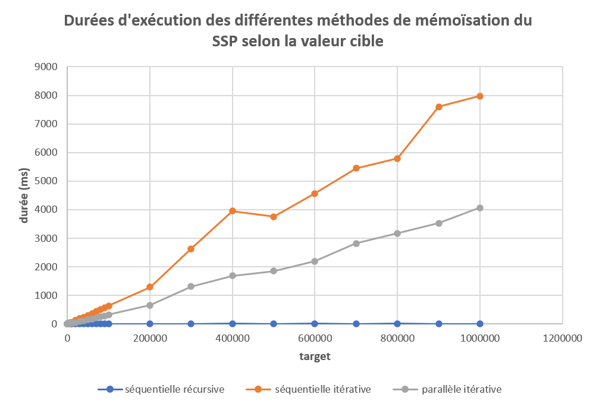
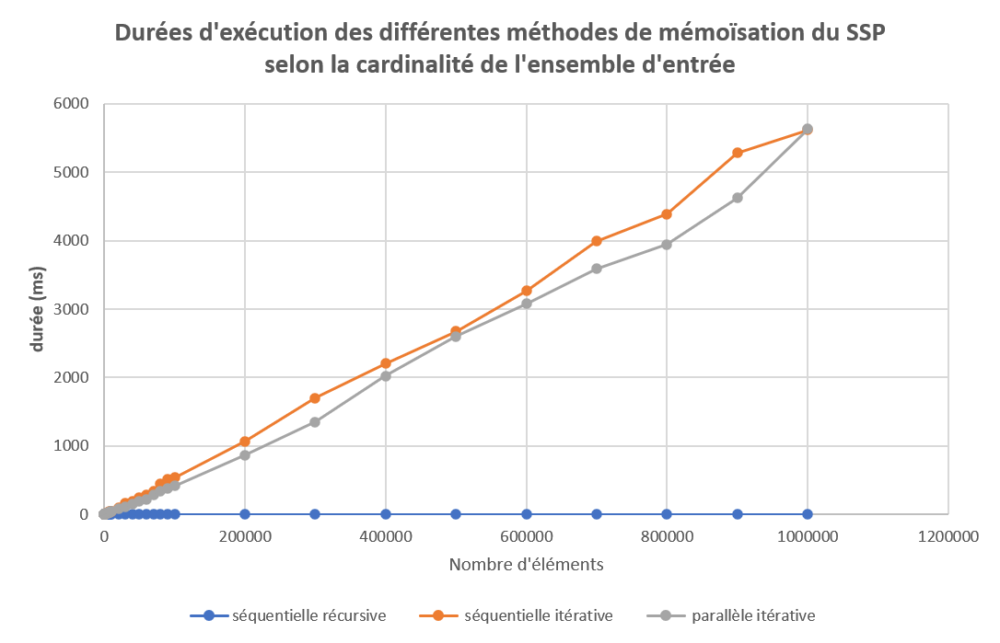
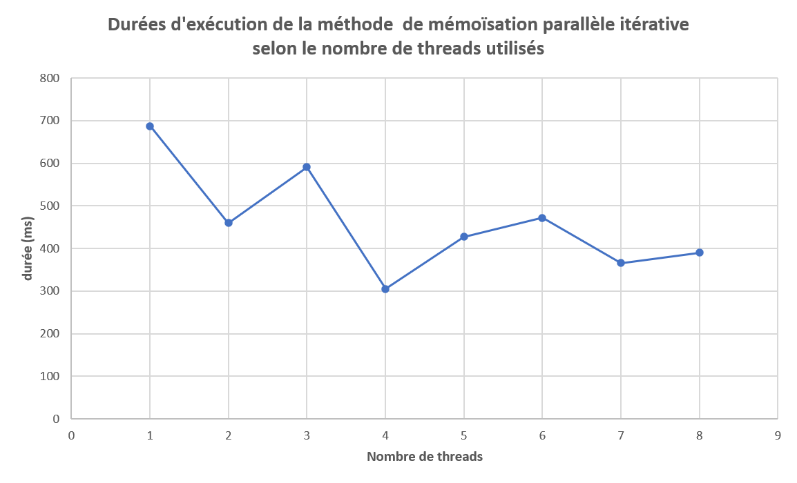

# Memoïsation
Léo Filoche - ESIR3 SI - Cours de HPC
## Installation
```bash
# Clone this repo
git clone https://gitlab.istic.univ-rennes1.fr/lfiloche/hpc4subsetsum.git
# Create the build folder for execution
mkdir build
```
## Exécution
```bash
gcc -o build/ssp ssp.c -fopenmp -lm && ./build/ssp
```
## Introduction
>**memoïsation** : Technique d'optimisation de code consistant à réduire le temps d'exécution d'une fonction en mémorisant ses résultats d'une fois à l'autre
> <cite>Wiktionnaire</cite>

Dans le cadre du *Subset Sum Problem*, la technique de memoïsation se traduit par l'utilisation d'un tableau, dans lequel sont stockés tous les résultats de calculs précédents.  Ce tableau est nommé ```sumMemory``` dans l'implémentation de cette technique (fichier ```filoche.c```).

## Source
Plusieurs sites évoquent l'utilisation de la méthode de mémoisation dans le cadre du Subset Sum Problem. Le site [favtutor](https://favtutor.com/blogs/subset-sum-problem) fut ma référence dans la compréhension et dans l'implémentation de l'approche récursive de la mémoisation. Les deux autres approches (itérative et parallélisée) ont été réfléchies et implémentées par moi-même.

## Approches
Il existe plusieurs approches pour implémenter utiliser de la mémoisation dans la résolution du *Subset Sum Problem*. 

### Approche récursive (```memoization_sequential_recursive```)
L'approche qui est habituellement utilisée est l'approche **récursive**, car elle est intuitive et garde la même logique que l'approche naïve de résolution du *SSP*. La seule différence est que l'on utilise un tableau (*sumMemory*) pour ne pas avoir à effectuer plusieurs fois le même calcul. Dans cette approche récursive, on part de la "fin" (dernière ligne, dernière colonne). Celle ci vaut ```true``` si :
- Considérer la valeur courante (la dernière valeur du tableau) permet d'obtenir la valeur ```target```.
- Considérer les valeurs précédentes (ignorer la valeur courante en réduisant la taille du tableau de ```1```) permet d'obtenir la valeur ```target``` 


#### Exemple

```
a={5, 3, 2, 3} // set of reference
n = 4 // a.length
target = 11 // sum to find in a

sumMemory =
   0️⃣1️⃣2️⃣3️⃣4️⃣5️⃣6️⃣7️⃣8️⃣9️⃣🔟11
0:5🆕🆕🆕🆕🆕✅❌🆕❌❌🆕❌
1:3🆕🆕🆕🆕🆕🆕🆕🆕✅❌🆕❌
2:2🆕🆕🆕🆕🆕🆕🆕🆕✅🆕🆕❌
3:3🆕🆕🆕🆕🆕🆕🆕🆕🆕🆕🆕✅

sumMemory[3][11]=✅ => subset sum exists !
```

Les cellules 🆕 sont celles dont la valeur n'a jamais été modifiée. <br>
Les cellules ✅ sont celles dont la valeur est ```true```. <br>
Les cellules ❌ sont celles dont la valeur est ```false```. 

La lecture du tableau est la suivante :
- la cellule ```sumMemory[3][11]``` indique qu'il est possible d'obtenir la valeur cible ```11``` en prenant en compte l'ensemble de ```a```. 
- la cellule ```sumMemory[2][8]``` indique qu'il est possible d'obtenir la valeur cible ```8``` en prenant en compte un sous-ensemble comprenant les 3 premières valeurs de ```a```, à savoir ```{5, 3, 2}```
- la cellule ```sumMemory[1][8]``` indique qu'il existe un sous-ensemble comprenant les 2 premières valeurs de ```a```, à savoir ```{5, 3}``` permettant d'atteindre la valeur cible ```8```
- la cellule ```sumMemory[0][5]``` indique qu'il existe un sous-ensemble comprenant la première valeur de ```a```, à savoir ```{5}```

On en déduit donc qu'on obtient ```11``` avec ```3``` (valeur de ```a[3]```), ```3``` (valeur de ```a[1]```), et ```5``` (valeur de ```a[0]```), autrement dit avec le sous-ensemble ```{3, 3, 5}``` 

### Approche itérative (```memoization_sequential_iterative```)
Bien qu'inhabituelle, il a été nécessaire d'implémenter l'**approche itérative** pour paralléliser le programme avec *OpenMP*. Cette approche passe en revue chaque case du tableau ```a``` et en déduit toutes les valeurs de sommes possibles. 

La construction du tableau est différente, au lieu d'être *sélective*, elle est *cumulative* : chaque ligne dépend de la précédente, à laquelle on a ajouté la valeur de la case courante de ```a``` dans l'équation. 

#### Exemple

En reprennant l'exemple ci-dessus, voici le tableau *sumMemory* qui en découle.
```
sumMemory =
   0️⃣1️⃣2️⃣3️⃣4️⃣5️⃣6️⃣7️⃣8️⃣9️⃣🔟11
0:5❌❌❌❌❌✅❌❌❌❌❌❌
1:3❌❌❌✅❌✅❌❌✅❌❌❌
2:2❌❌✅✅❌✅❌✅✅❌✅❌
3:3❌❌✅✅❌✅✅✅✅❌✅✅

sumMemory[3][11]=✅ => subset sum exists !
```
Bien que le tableau final soit différent, la lecture est toujours la même : on part de la dernière cellule, on se décalle horizontalement de la valeur de a[i], et verticalement tant que la valeur de vérité est à ```true```. 

Ici, ```sumMemory[3][11]```, ```sumMemory[1][8]```, ```sumMemory[0][5]``` sont donc à prendre en compte, et renseignent que le sous-ensemble ```{3, 3, 5}``` forme la solution espérée.

### Approche itérative parallélisée (```memoization_parallel_iterative```)
Cette approche est foncièrement la même que l'approche itérative décrite précédemment (*séquentielle*). La seule différence est que la construction de *sumMemory* est multithreadée. Le *multithreading* a lieu au niveau de la construction des cellules d'une même ligne. Dans l'exemple, si 2 threads étaient alloués, lors du traitement d'une ligne fixée, les cellules allant de l'indice ```0``` à l'indice ```5``` compris seraient traitées par un thread, et les cellules allant de l'indice ```6``` à l'indice ```11``` compris seraient traitées par un autre thread.

On pourrait vouloir paralléliser plus, c'est-à-dire paralléliser au niveau des lignes (avec 2 threads, la ligne ```0``` et ```1``` pour un thread, et ```2``` et ```3``` l'autre thread). Cependant, chaque ligne dépendant de la précédente, on ne peut pas agir à ce niveau concernant la parallélisation.

## Performances
Afin de pouvoir comparer les 3 approches, leurs performances ont été enregistrées selon différents paramètres. Voici les résultats.

### 1. La valeur de la cible


|paramètre | valeur|
|----------| -----|
|n | 1000| 
|maximum element value | 10000|
|NUM_THREADS | 5 |

### 2. La taille de l'ensemble


|paramètre | valeur|
|----------| -----|
|target | 1000| 
|maximum element value | 10000|
|NUM_THREADS | 5 |

### 3. Le nombre de threads utilisés


|paramètre | valeur|
|----------| -----|
|n | 100000 |
|target | 1234| 
|maximum element value | 10000|


## Observations

<p align="justify">
A la vue de ces résultats, on fait le constat que l'utilisation de la méthode itérative actuelle n'est pas optimale et ne permet pas de remplacer la méthode récursive.
Cela s'explique sans doute par le fait que la méthode récursive se concentre sur le problème à résoudre (la somme à trouver), tandis que la méthode itérative calcule toutes les sommes possibles entre les éléments de l'ensemble.

On observe que la parallélisation des calculs relatifs à chaque élément de l'ensemble permet d'améliorer légèrement les performances lorsque la valeur cible est élevée. Cela correspond à notre intuition : la parallélisation consiste à déléguer les calculs à plusieurs fils d'exécution distincts, de sorte à faire plus de traitement pendant une même période donnée.
Cependant cette amélioration est à nuancer : la création de nouveaux threads a un coût significatif. De plus, la durée de traitement de chaque ligne de *sumMemory* dépend de celle du thread le plus long (il faut attendre que tous les threads aient terminé pour pouvoir traiter la ligne suivante).
Si, au départ, la multiplication du nombre de threads s'avère intéressante, à partir d'un certain seuil cela n'est plus si évident. Dans les cas étudiés, l'utilisation de 5 threads (sur 8 possibles) peut donc être qualifiée de raisonnable. 
<p>

## Conclusion
<p align="justify">
Pour conclure, on note que la technique de mémoisation initiale, à savoir récursive est une bonne méthode. Stocker les valeurs des calculs effectués précédemment pour éviter d'avoir à les refaire est une bonne idée et se ressent au niveau des performances. Cependant, une approche naïve de sa version itérative rend les performances moins bonnes car elle consiste à effectuer <b>tous</b> les calculs possibles, et donc plus de calculs !
Une parallélisation de cette méthode naïve en améliore les performances, mais pas au point de dépasser la méthode initiale (récursive). Si l'on souhaite optimiser cette approche, il faudrait faire en sorte de faire seulement les calculs nécessaires à la recherche d'un sous ensemble.

Enfin, (et ce n'est pas à négliger), quelle que soit la méthode utilisée, l'utilisation de la mémoisation est contrainte par l'espace mémoire. Ce qui fait sa force, est aussi sa faiblesse : pour des valeurs cibles très grandes ou des ensembles très grands, cette méthode n'est pas applicable.
</p>